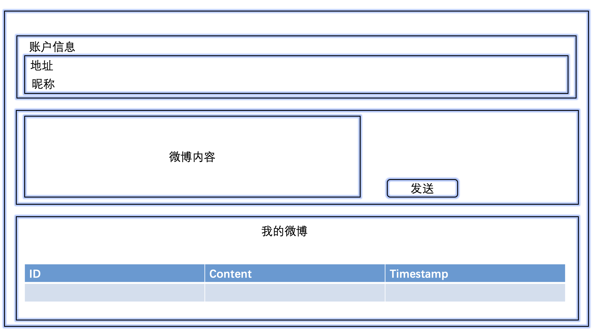
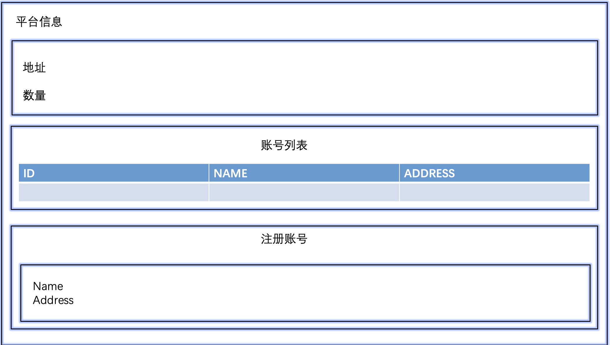

## 去中心化微博

### 功能

#### [WeiboAccount.sol](contracts/WeiboAccount.sol)
> 主要功能,发送微博,查找
- 权限控制
- 发送微博
- 通过id查找微博
- 查看最新一条微博
- 返回微博的总数
- 返回微博账户的所有者
- 打赏
- 记录打赏的事件
- 回退函数(接受打赏)
- 摧毁合约
- 获取当前账户

#### [WeiboRegistry.sol](contracts/WeiboRegistry.sol)

> 提供一个展示微博账户的平台,主要起一个对微博账户进行维护的功能.

- 注册账户
- 账户的数量
- 通过id查找地址
- 通过昵称查找地址
- 通过地址查找昵称
- 摧毁合约的函数


### 通过remix编译修改

https://remix.ethereum.org/

### 通过truffle框架编译测试
- 初始化项目
```
truffle init 
```


- 将sol文件复制到contracts文件夹中

- 编译
```
truffle compile 
```

- 创建部署文件,注意序号
  - [2_weiboregistry_migrate.js](migrations/2_weiboregistry_migrate.js)  
  ```
  const WeiboRegistry = artifacts.require("WeiboRegistry");

    module.exports = function (deployer) {
    deployer.deploy(WeiboRegistry);
    };

  ``` 
  
- 测试
  - js版本 [TestWeiboAccount.js](test/TestWeiboAccount.js)
  - sol版本 [TestWeiboRegistry.sol](test/TestWeiboRegistry.sol)

### 前端部署 

- 用户界面

  - 

- 平台页面
  -   

